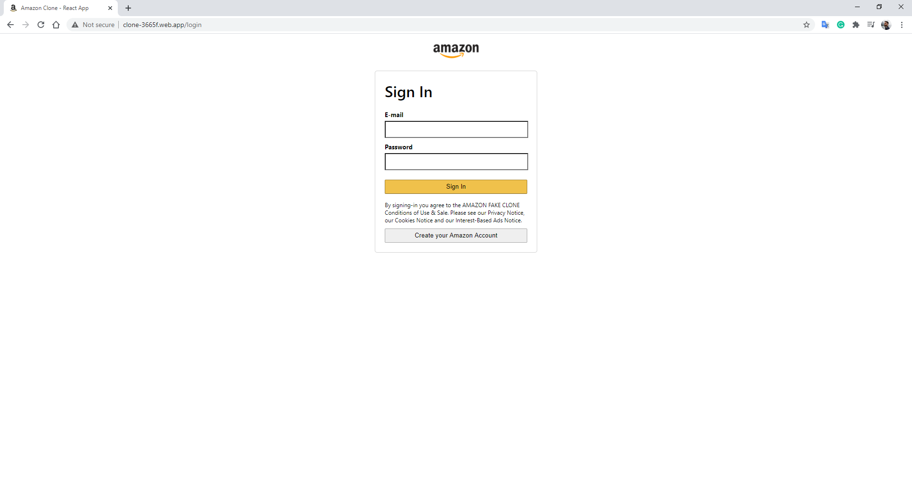

# Amazon Clone

## The project
Web application created mainly with React and deployed using Google Firebase.  
React Router for UI, React Context API for basket, user authentication, payment functionality with Stripe (to be implemented).  
This was my first project using React and I absolutely enjoyed working with it.
  

### Deployed website
You can find the deployed website at https://clone-3665f.web.app/ 

### Pages
The web app consists of a **home page**, **authentication page**, **basket** with a "Remove from Basket" functionality, and the **checkout** page.
  

  

  

## The steps
### Coding
The coding was made during the React JavaScript Challenge.  

## Technologies and tools used
HTML5, CSS3, React, and Firebase.  

    &nbsp;&nbsp;
    &nbsp;&nbsp;
    &nbsp;&nbsp;
    &nbsp;&nbsp;
    &nbsp;&nbsp;
    &nbsp;&nbsp;
    

## Next steps
**Payment Functionality:**  
A next step will be to implement the payment functionality using Stripe. 

**Responsiveness:**  
Still lacking a better responsiveness for mobile view. 

## That's it!
Thanks for reading! 😀  
I'm Guilherme. Front-End Web Developer.  

You can find me on:  
    

    &nbsp;&nbsp;

[website]: [https://gdhebling.github.io/photographer-portfolio/]
